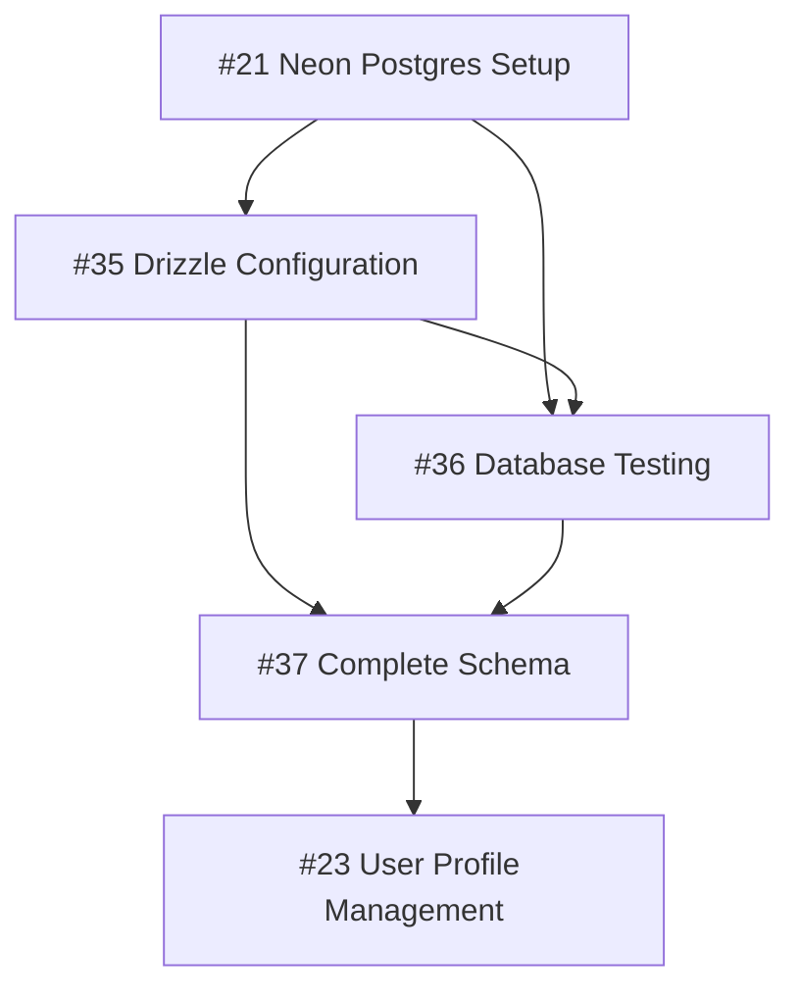

# Milestone 1.3 Database Setup - Issue Dependencies

## Status: Dependencies Verified ✅
**Updated**: January 31, 2026  
**Context**: Issue dependency relationships for Milestone 1.3 Database Setup

## 🔗 **Dependency Chain Overview**

## 📋 **Issue Dependencies (Execution Order)**

### **1. Issue #21: Setup Neon Postgres Database with pgvector**
- **Dependencies**: Milestone 1.2 Authentication complete
- **Status**: Foundation issue - no internal dependencies
- **Enables**: Issues #35, #36

### **2. Issue #35: Setup Drizzle Configuration and Migration Workflow**
- **Dependencies**: Issue #21 (Neon Postgres Database Setup) ✅
- **Enables**: Issues #36, #37, #23

### **3. Issue #36: Implement Database Testing Infrastructure**  
- **Dependencies**: 
  - Issue #21 (Neon Postgres Database Setup) ✅
  - Issue #35 (Drizzle Configuration Setup) ✅
- **Enables**: Issue #37

### **4. Issue #37: Complete StudyPuck Schema Implementation in Drizzle**
- **Dependencies**:
  - Issue #21 (Neon setup) ✅
  - Issue #35 (Drizzle config) ✅  
  - Issue #36 (Testing infrastructure) ✅
- **Enables**: Issue #23 and all future database operations

### **5. Issue #23: Implement User Profile Management**
- **Dependencies**:
  - Issue #21 (Neon Postgres Setup) ✅
  - Issue #35 (Drizzle Configuration) ✅
  - Issue #37 (Complete Schema) ✅
- **Enables**: Future user management features

## ⚡ **Parallel Execution Opportunities**

### **Can Run in Parallel**:
- **Issues #35 and #36** can start simultaneously after #21 completes
- Both depend only on #21 and can work independently

### **Must Be Sequential**:
- **Issue #37** requires both #35 and #36 to be complete
- **Issue #23** requires the full stack (#21, #35, #37) to be ready

## 🚀 **Recommended Execution Strategy**

### **Phase 1: Foundation**
1. Complete Issue #21 (Neon Postgres Setup)

### **Phase 2: Infrastructure (Parallel)**  
2. Start Issue #35 (Drizzle Configuration)
3. Start Issue #36 (Database Testing) in parallel

### **Phase 3: Schema Implementation**
4. Complete Issue #37 (Complete Schema) after #35 and #36

### **Phase 4: Application Integration**
5. Complete Issue #23 (User Profile Management)

## ✅ **Dependency Verification**

All issue descriptions and comments have been updated to reflect the correct dependency relationships:

- **Issue #21**: ✅ Correct (foundation)
- **Issue #35**: ✅ Correct dependencies and enables
- **Issue #36**: ✅ Updated with specific Issue #35 reference  
- **Issue #37**: ✅ Correct dependencies confirmed
- **Issue #23**: ✅ Updated to depend on #21, #35, #37

## 🔄 **Future Considerations**

- **Testing Strategy**: Issue #36 enables comprehensive testing for all subsequent work
- **Schema Evolution**: Issue #37 provides the foundation for all future database changes
- **Type Safety**: Complete Drizzle setup ensures type-safe database operations throughout the application

---

**Result**: Clear execution path for Milestone 1.3 with optimal parallel work opportunities and proper dependency management.